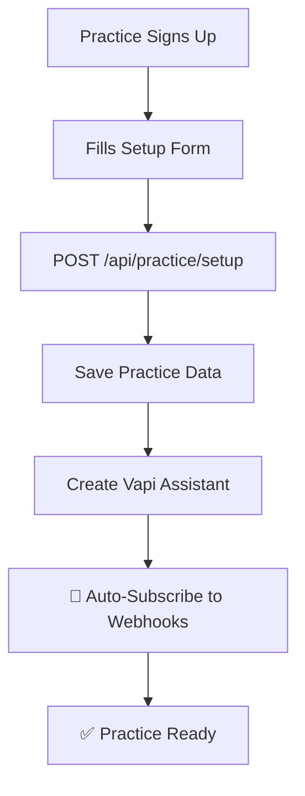
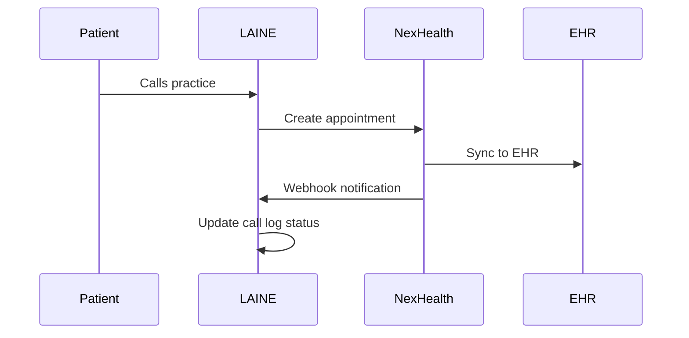

# 🏢 **LAINE SaaS - NexHealth Integration Setup Guide**

This guide explains how to set up NexHealth webhook integration for a **multi-practice SaaS platform**.

## 🏗️ **SaaS Architecture Overview**

### **Your Setup:**
- ✅ **One NexHealth Developer Account** → `https://developers.nexhealth.com/`
- ✅ **One API Key** → Works for all practices
- ✅ **Multiple Institutions** → One per practice that signs up
- ✅ **Unique Subdomains** → Each practice gets their own (e.g., `sunnydale-dental`, `brightsmile-clinic`)
- ✅ **One Webhook Endpoint** → Handles events from ALL practices

---

## 🚀 **Initial Platform Setup** (One-Time)

### **Step 1: Create Main Webhook Endpoint**

Run this **once** to set up the primary webhook endpoint:

```bash
node scripts/setup-nexhealth-webhook-saas.js setup
```

This will:
- ✅ Create a webhook endpoint at `https://yourdomain.com/api/nexhealth/webhook`
- ✅ Generate a webhook secret
- ✅ Give you environment variables to add

### **Step 2: Add Environment Variables**

Add these to your `.env`:

```env
NEXHEALTH_API_KEY="your_nexhealth_api_key"
NEXHEALTH_WEBHOOK_SECRET="generated_webhook_secret_from_step_1"
NEXHEALTH_WEBHOOK_ENDPOINT_ID="webhook_endpoint_id_from_step_1"
```

---

## 🏥 **Practice Onboarding Flow** (Per Practice)

### **Automatic Onboarding** ✨

When a practice completes their setup in your app:

1. **Practice fills out setup form** → Name, subdomain, location, providers, etc.
2. **Your app saves practice data** → Via `/api/practice/setup`
3. **🔗 Webhook subscription happens automatically** → Your app calls `subscribePracticeToWebhooks()`
4. **✅ Practice is ready** → Appointment events will flow to your webhook

### **Manual Onboarding** (If Needed)

If automatic setup fails, you can manually subscribe a practice:

```bash
node scripts/setup-nexhealth-webhook-saas.js add-practice SUBDOMAIN
```

Example:
```bash
node scripts/setup-nexhealth-webhook-saas.js add-practice sunnydale-dental
```

---

## 🔄 **How It Works in Production**

### **1. Practice Setup Process**



### **2. Appointment Booking & Sync**



### **3. Webhook Event Processing**

When an appointment is booked:

1. **NexHealth sends webhook** → `POST /api/nexhealth/webhook`
2. **Your app identifies practice** → Using `payload.subdomain`
3. **Find matching call log** → Using `appointment_id` + `practice_id`
4. **Update status** → `COMPLETED_EHR_SYNCED` or `FAILED_EHR_SYNC`

---

## 📋 **Webhook Payload Structure**

### **Appointment Insertion Event**

```json
{
  "resource_type": "Appointment",
  "event": "appointment_insertion",
  "subdomain": "sunnydale-dental",  // 🎯 This identifies the practice
  "status": "success",              // or "failure"
  "data": {
    "id": "12345",
    "foreign_id": "EHR-67890",     // EHR appointment ID
    "patient_id": "98765",
    "provider_id": "11111",
    "start_time": "2024-01-15T10:00:00Z",
    // ... more appointment data
  },
  "message": "Appointment successfully synced"
}
```

---

## 🔧 **Environment Variables**

### **Required for Production:**

```env
# NexHealth Integration
NEXHEALTH_API_KEY="your_api_key_from_developers_portal"
NEXHEALTH_WEBHOOK_SECRET="generated_during_setup"
NEXHEALTH_WEBHOOK_ENDPOINT_ID="webhook_endpoint_id"

# App Configuration  
NEXT_PUBLIC_APP_URL="https://yourdomain.com"

# Database & Auth (existing)
DATABASE_URL="your_database_url"
CLERK_SECRET_KEY="your_clerk_secret"
# ... other existing vars
```

---

## 🎯 **Practice Data Structure**

Each practice in your database needs:

```typescript
{
  id: string
  name: string
  nexhealth_subdomain: string        // 🎯 Critical for routing
  nexhealth_location_id: string
  nexhealth_selected_provider_ids: string[]
  nexhealth_default_operatory_ids: string[]
  timezone: string
  clerk_user_id: string
  vapi_assistant_id?: string
}
```

---

## ✅ **Verification Checklist**

### **Platform Setup:**
- [ ] Webhook endpoint created via script
- [ ] Environment variables added
- [ ] App deployed with webhook route accessible

### **Per Practice:**
- [ ] Practice completes setup form
- [ ] Practice data saved to database
- [ ] Webhook subscription confirmed (check logs)
- [ ] Test appointment booking works
- [ ] Webhook events received and processed

### **Testing:**
- [ ] Book test appointment via Vapi
- [ ] Check webhook receives event
- [ ] Verify call log status updated
- [ ] Confirm EHR sync status

---

## 🚨 **Troubleshooting**

### **Common Issues:**

**1. Practice Not Receiving Webhooks**
```bash
# Check if practice is subscribed
node scripts/setup-nexhealth-webhook-saas.js add-practice SUBDOMAIN
```

**2. Webhook Signature Verification Fails**
- Check `NEXHEALTH_WEBHOOK_SECRET` in environment
- Verify webhook endpoint URL is accessible

**3. Practice Not Found in Database**
- Ensure `nexhealth_subdomain` matches exactly
- Check practice exists in database

**4. Call Log Not Updating**
- Verify `booked_appointment_nexhealth_id` is stored correctly
- Check practice_id matches webhook subdomain lookup

### **Debug Commands:**

```bash
# Test webhook endpoint
curl -X GET https://yourdomain.com/api/nexhealth/webhook

# Check practice webhook subscription
node scripts/setup-nexhealth-webhook-saas.js add-practice SUBDOMAIN

# View webhook events in logs
tail -f logs/webhook.log
```

---

## 🎉 **Success Metrics**

When everything is working:

- ✅ Practices can complete setup without manual intervention
- ✅ Appointment bookings sync to EHR automatically  
- ✅ Call logs show `COMPLETED_EHR_SYNCED` status
- ✅ Webhook events logged for all practices
- ✅ No 401/403 errors in webhook endpoint

---

## 📚 **Additional Resources**

- **NexHealth API Docs:** `https://docs.nexhealth.com/`
- **Webhook Testing:** `https://webhook.site/` for development
- **Practice Management:** Internal dashboard at `/practice/setup`

---

**🎯 Your SaaS is now ready for multi-practice NexHealth integration!** 